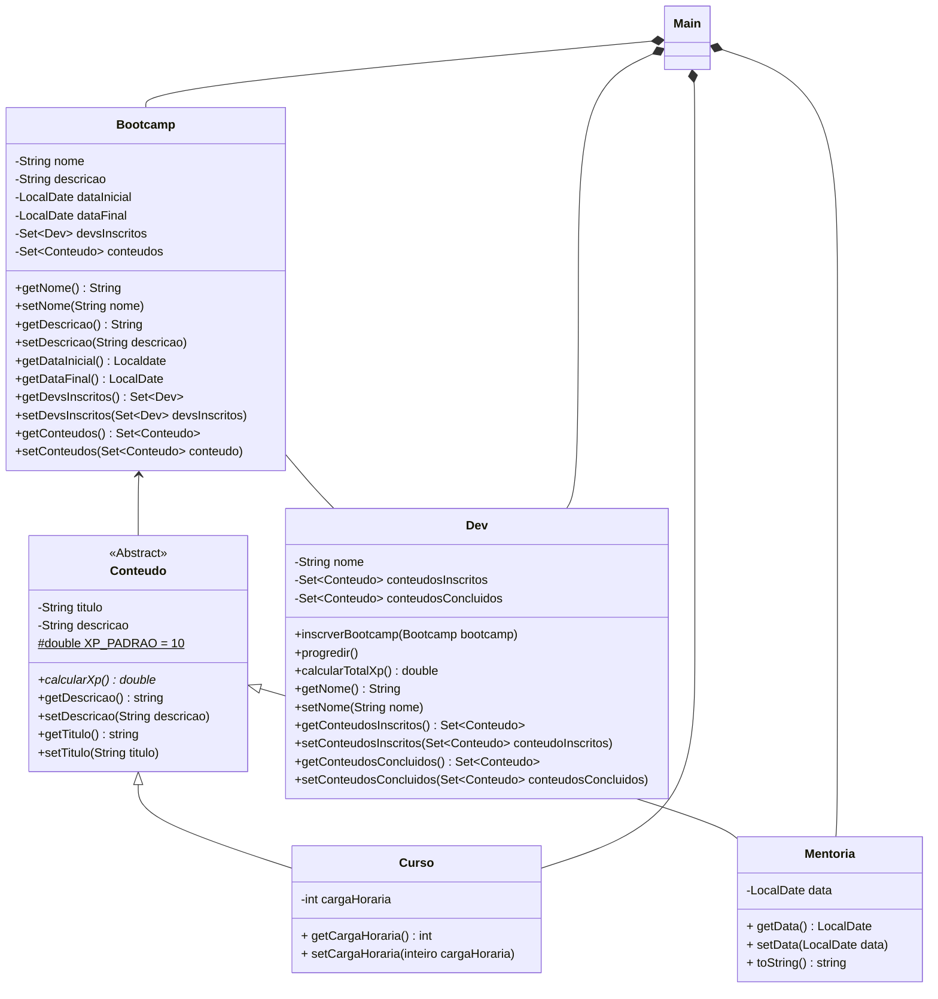

# Bootcamp Java DIO 👨‍⚖️👨‍💻✨
Este repositório é destinado ao estudo de Programação Orientada a Objeto, onde realizei a implementação de um pequeno sistema do bootcamp, utilizando classes, Listas, etc.

## 📍Stack utilizada

<div>
  
</div>

## 📦 Estrutura do projeto
````
bootcamp-java-dio/
├── .idea/                                
├── src/                               
|   ├── dominio/
|   |  ├── Bootcamp.java
|   |  ├── Conteudo.java
|   |  ├── Curso.java
|   |  ├── Dev.java
|   |  └── Mentoria.java
|   └── Main.java
├── .gitignore
├── .bootcamp-java-dio.iml
└── README.md
````

## diagrama de classe



